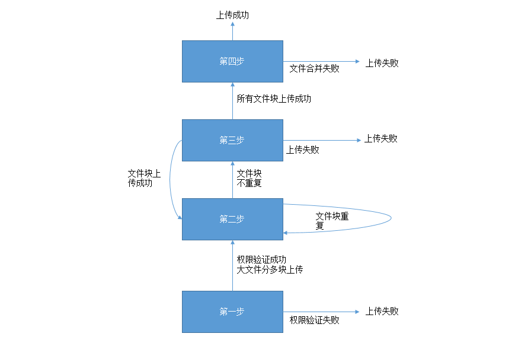

### 文件服务JAVA API

对比网页直传和服务端上传，网页直传可以使用上传控件，上传控件提供了分块上传，计算文件md5，文件块md5，异步请求验证权限，验证重复等功能。
不同于网页直传，服务端上传必须得在后台实现上传控件的这些功能，文件服务将提供java服务端api。其他语言得自行实现。网页直传与服务端上传共用一套接口，
为任何符合api规范的http请求提供服务，上传都必须用post方式请求，下载都必须用get方式请求，请求必须符合RFC 1867协议规范，下面是api规范：

为了展示方便，下面的url采用get请求方式展现。   
大文件上传分四个步骤： 
    
第一步:验证权限。以下面url为例，发送一个http请求，该请求必须是post请求，参数`code`，`signature`，`fileInfo`，`step`都为必填项。`signature`中的值是urlencode(base64(hmac-sha1(key，date+'\n'+fileMd5+'\n'+filename)))，`fileInfo`中的值是urlencode(base64(date+'\n'+fileMd5+'\n'+filename+'\n'+filesize))。
`step` = 1，`code`为项目编编码。  
   
    /upload.html?code=workFlow&signature=vjbyPxybdZaNmGa%2ByT272YEAiv4%3D&fileInfo=bdZaNmGa%2x3wst&2fcByT272YEAi&step=1  

第二步:验证文件块重复，以下面url为例，发送一个http请求，该请求必须是post请求，参数`fileMd5`，`chunkOrder`，`fileSize`，`chunkSize`，`step`都为必填项。
`step` = 2，`chunkSize`上传文件块大小，`chunkOrder`上传文件块顺序，`fileMd5`为文件md5值(非文件块md5值)。  

    /upload.html?chunkOrder=1&chunkSize=524288000&fileSize=1224288000&fileMd5=vjbyPxybdZaNmGa%2ByT272YEAiv4%3D&chunkOrder=1&step=2

第三步:上传文件，以下面url为例，发送一个http请求，该请求必须是post请求。参数`code`，`signature`，`fileInfo`，`step`,`chunk`都为必填项。`signature`中的值是urlencode(base64(hmac-sha1(key，date+'\n'+fileMd5+'\n'+filename+'\n'+chunkmd5)))，`fileInfo`中的值是urlencode(base64(date+'\n'+fileMd5+'\n'+filename+'\n'+filesize+'\n'+chunkmd5+'\n'+chunksize))。
`step` = 3，`code`为项目编编码,`chunk`上传文件块顺序。向下面的url发起上传请求，文件块内容必须包含在请求正文中。  
    
    /upload.html?code=workFlow&signature=vjbyPxybdZaNmGa%2ByT272YEAiv4%3D&fileInfo=bdZaNmGa%2x3wst&2fcByT272YEAi&step=3  
    
第四步:通知文件合并，以下面url为例，发送一个http请求，该请求必须是post请求，参数`fileMd5`，`fileName`，`fileSize`，`step`，`code`都为必填项。
`step` = 4，`chunkSize`上传文件块大小，`chunkOrder`上传文件块顺序，`fileMd5`为文件md5值(非文件块md5值)，savepath为上传文件路径，可选。如果不填，则上传到三方系统默认路径。  

    /upload.html?fileMd5=vjbyPxybdZaNmGa%2ByT272YEAiv4%3D&fileName=test.txt&fileSize=524288000&step=4&savepath=/var/tmp
    
    
    
api大文件上传执行步骤:第一步，验证权限，权限验证失败，中断上传，否则，将文件按分块大小分为多块，循环操作后面步骤：第二步验证文件块是否重复，重复，跳过当前文件块上传，执行下一块文件块验证，不重复，执行第三步
文件上传，文件上传权限验证失败或上传失败，中断上传。如果上传成功，继续第二步，成功再第三步，依次类推，直到文件循环结束。前面步骤都完成后，执行第四步，合并文件。如果返回合并成功，则上传成功。否则，上传失败。
例如：上传200M的test.rar，步骤一上传权限验证，验证成功就停止上传，验证成功则将test.rar拆分为4个50M的分块。循环四次第二步和三步，
文件块不重复，则上传，文件块重复，则跳过，上传成功继续下一轮验证文件块重复和上传。直到四次循环结束后，都成功，则第四步，合并文件，否则循环中有一次失败则中断上传。
      
    
    
文件上传请求头信息：
第一二四步都使用一样的请求报文，只是参数不同。例如:  
    
     POST /upload.html HTTP/1.1
     Accept: */*
     Cache-Control: no-cache
     Transfer-Encoding: chunked
     Content-Type: application/x-www-form-urlencoded; charset=UTF-8
     Host: gnif.file.com
     Connection: Keep-Alive
     User-Agent: Gionee-FileApi/1.0
     Accept-Encoding: gzip,deflate
     
          
               
第三步上传文件请求头信息：
    
    POST /upload.html HTTP/1.1
    Transfer-Encoding: chunked
    Content-Type:multipart/form-data;boundary=gPxThJUDDsgnIt1IDvo-JHc1kP0dHT90L
    Host: gnif.file.com
    Connection: Keep-Alive
    User-Agent: Gionee-FileApi/1.0
    Accept-Encoding: gzip,deflate
    
    
四个步骤对应的响应报文如下:  

    HTTP/1.1 200 OK
    Date: Thu, 01 Jun 2017 10:13:56 GMT
    Server: Apache/2.4.7 (Centos)
    Vary: Accept-Encoding
    Keep-Alive: timeout=5, max=100
    Connection: Keep-Alive
    Content-Type: application/json

    callback({"isSuccess":true,"message":"上传成功","isOk":true,"attributes":{"fileNo":4883}})
    
    
    

 
 
 

服务端普通文件上传，当文件小于50M时，可使用普通文件上传接口。下面是api规范：     
向`/common_upload.html`发起一个http post请求，文件块内容包含在请求正文中。`signature`中的值是urlencode(base64(hmac-sha1(key，date+'\n'+fileMd5+'\n'+filename)))，`fileInfo`中的值是urlencode(base64(date+'\n'+fileMd5+'\n'+filename+'\n'+filesize))，`code`为项目编码  

    /common_upload.html?code=workFlow&signature=vjbyPxybdZaNmGa%2ByT272YEAiv4%3D&fileInfo=bdZaNmGa%2x3wst&2fcByT272YEAi
    
普通文件上传请求头信息:
 
     POST /common_upload.html HTTP/1.1
     Transfer-Encoding: chunked
     Content-Type:multipart/form-data;boundary=gPxThJUDDsgnIt1IDvo-JHc1kP0dHT90L
     Host: gnif.file.com
     Connection: Keep-Alive
     User-Agent: Gionee-FileApi/1.0
     Accept-Encoding: gzip,deflate
     
     
普通文件上传对应响应报文如下:
     
     HTTP/1.1 200 OK
     Date: Thu, 01 Jun 2017 10:13:56 GMT
     Server: Apache/2.4.7 (Centos)
     Vary: Accept-Encoding
     Keep-Alive: timeout=5, max=100
     Connection: Keep-Alive
     Content-Type: application/json
 
     callback({"isSuccess":true,"message":"上传成功","isOk":true,"attributes":{"fileNo":4883}})
          
          
服务端下载接口，下面是api规范：
向`/download.html`发起一个http请求，该请求必须是get请求，其中signature = urlencode(base64(hmac-sha1(key，count+'\n'+expire+'\n'+fileNo)))，
policy =urlencode(base64(count+'\n'+expire+'\n'+fileNo))。count,expire,fileNo为必填项，请求成功通过输入流下载。

    /download.html?code=workFlow&signature=vjbyPxybdZaNmGa%2ByT272YEAiv4%3D&policy=vjbyPsdf&2x44g3xybdZaNmGa%
    
文件下载请求头信息：  
    
    POST /download.html HTTP/1.1
    Accept: */*
    Cache-Control: no-cache
    Transfer-Encoding: chunked
    Content-Type: application/x-www-form-urlencoded; charset=UTF-8     
    Host: gnif.file.com
    Connection: Keep-Alive
    User-Agent: Gionee-FileApi/1.0
    Accept-Encoding: gzip,deflate
     
文件下载对应响应报文  

    HTTP/1.1 200 OK
    Date: Thu, 01 Jun 2017 10:22:55 GMT
    Content-Type: application/x-download; charset=utf-8
    Content-disposition: attachment; filename=这里是文件名称..
    Transfer-Encoding: chunked
    Server: Jetty(9.2.2.v20140723)  
  
    这里是文件内容..